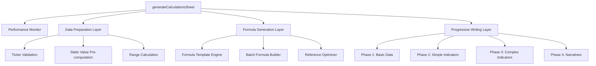

# Design Document: Calculations Sheet Optimization

## Overview

This design addresses the performance optimization of the Google Apps Script-based Institutional Terminal's Calculations Sheet. The current implementation suffers from slow loading times due to inefficient formula generation, excessive API calls, and suboptimal data processing patterns. The optimization will focus on batch operations, formula simplification, caching strategies, and progressive loading to achieve target performance of 15 seconds for 20 tickers and 30 seconds for 50 tickers.

## Architecture

### Current Architecture Issues

The existing `generateCalculationsSheet()` function exhibits several performance bottlenecks:

1. **Individual Cell Operations**: Uses `setFormula()` and `setValue()` for individual cells instead of batch operations
2. **Complex Nested Formulas**: Generates deeply nested formulas with multiple MATCH/INDEX lookups
3. **Redundant GOOGLEFINANCE Calls**: Multiple formulas call GOOGLEFINANCE for the same data
4. **Synchronous Processing**: Processes all tickers sequentially without progressive feedback
5. **Inefficient Range References**: Uses entire column references (A:A) instead of specific ranges

### Optimized Architecture

The new architecture will implement a three-tier optimization strategy:



## Components and Interfaces

### 1. Performance Monitor Component

**Purpose**: Track execution time and identify bottlenecks

```javascript
class PerformanceMonitor {
  constructor(functionName) {
    this.startTime = Date.now();
    this.checkpoints = [];
    this.functionName = functionName;
  }
  
  checkpoint(label) {
    const elapsed = Date.now() - this.startTime;
    this.checkpoints.push({ label, elapsed });
    console.log(`${this.functionName} - ${label}: ${elapsed}ms`);
  }
  
  complete() {
    const totalTime = Date.now() - this.startTime;
    console.log(`${this.functionName} completed in ${totalTime}ms`);
    return totalTime;
  }
}
```

### 2. Data Preparation Layer

**Purpose**: Pre-compute static values and prepare data structures

```javascript
class DataPreparationLayer {
  constructor(inputSheet, dataSheet) {
    this.inputSheet = inputSheet;
    this.dataSheet = dataSheet;
    this.tickerData = new Map();
  }
  
  prepareTickers() {
    // Validate and clean ticker list
    // Pre-compute static ranges and references
    // Cache DATA sheet references
  }
  
  getCachedValue(ticker, attribute) {
    // Return cached values from DATA sheet
    // Avoid redundant GOOGLEFINANCE calls
  }
}
```

### 3. Formula Generation Layer

**Purpose**: Generate optimized formulas using templates and batch operations

```javascript
class FormulaGenerator {
  constructor(dataLayer, locale) {
    this.dataLayer = dataLayer;
    this.separator = locale.startsWith('en') ? ',' : ';';
    this.templates = new Map();
  }
  
  generateBatchFormulas(tickers, formulaType) {
    // Generate 2D array of formulas for batch writing
    // Use direct references instead of MATCH/INDEX where possible
    // Minimize nested formula depth
  }
  
  optimizeFormula(formula) {
    // Replace complex lookups with direct references
    // Minimize volatile function usage
    // Use fixed ranges instead of entire columns
  }
}
```

### 4. Progressive Writing Layer

**Purpose**: Write data in phases to provide immediate feedback

```javascript
class ProgressiveWriter {
  constructor(sheet) {
    this.sheet = sheet;
    this.phases = [];
  }
  
  addPhase(name, data, range) {
    this.phases.push({ name, data, range });
  }
  
  executePhases(monitor) {
    this.phases.forEach(phase => {
      this.writePhase(phase);
      SpreadsheetApp.flush(); // Show progress immediately
      monitor.checkpoint(`Phase: ${phase.name}`);
    });
  }
}
```

## Data Models

### Ticker Data Structure

```javascript
const TickerData = {
  symbol: String,           // e.g., "AAPL"
  dataColumnStart: Number,  // Starting column in DATA sheet
  cachedValues: {
    price: Number,
    ath: Number,
    pe: Number,
    eps: Number,
    lastRowCount: Number
  },
  ranges: {
    high: String,    // e.g., "B5:B"
    low: String,     // e.g., "C5:C"
    close: String,   // e.g., "D5:D"
    volume: String   // e.g., "E5:E"
  }
};
```

### Formula Template Structure

```javascript
const FormulaTemplate = {
  name: String,           // e.g., "RSI", "MACD"
  template: String,       // Template with placeholders
  dependencies: Array,    // Required data columns
  complexity: Number,     // Relative complexity score
  phase: Number          // Loading phase (1-4)
};
```

### Performance Metrics Structure

```javascript
const PerformanceMetrics = {
  totalTime: Number,
  tickerCount: Number,
  phases: Array,
  bottlenecks: Array,
  apiCalls: Number,
  formulaCount: Number
};
```

## Correctness Properties

*A property is a characteristic or behavior that should hold true across all valid executions of a system-essentially, a formal statement about what the system should do. Properties serve as the bridge between human-readable specifications and machine-verifiable correctness guarantees.*

### Property 1: Performance Bounds
*For any* ticker list with 20 or fewer tickers, the generateCalculationsSheet function should complete within 15 seconds
**Validates: Requirements 1.1**

### Property 2: Scalability Performance
*For any* ticker list with 50 or fewer tickers, the generateCalculationsSheet function should complete within 30 seconds
**Validates: Requirements 1.2**

### Property 3: Batch Operation Usage
*For any* formula writing operation involving multiple cells, the system should use setFormulas() with 2D arrays instead of individual setFormula() calls
**Validates: Requirements 1.3, 4.1**

### Property 4: Formula Complexity Bounds
*For any* generated formula, the nesting depth should not exceed 5 levels to maintain computational efficiency
**Validates: Requirements 1.4, 2.2**

### Property 5: Data Preservation
*For any* sheet refresh operation, existing data should be preserved when only partial updates are needed
**Validates: Requirements 1.5**

### Property 6: Direct Reference Optimization
*For any* formula that references DATA sheet values, direct cell references should be used instead of MATCH/INDEX lookups when the position is known
**Validates: Requirements 2.1**

### Property 7: Static Value Pre-computation
*For any* calculation that involves static values, those values should be computed in Apps Script rather than in spreadsheet formulas
**Validates: Requirements 2.2**

### Property 8: OFFSET Range Optimization
*For any* OFFSET function usage, the range size should be limited to the minimum required rows based on available data
**Validates: Requirements 2.3**

### Property 9: Explicit Range Usage
*For any* array function, explicit ranges should be specified instead of entire column references
**Validates: Requirements 2.4**

### Property 10: GOOGLEFINANCE Centralization
*For any* market data requirement, GOOGLEFINANCE calls should be centralized in the DATA sheet and referenced from CALCULATIONS
**Validates: Requirements 3.1**

### Property 11: Cached Value Usage
*For any* PE, EPS, or ATH value requirement, cached values from DATA sheet row 3 should be used instead of new GOOGLEFINANCE calls
**Validates: Requirements 3.2, 3.3**

### Property 12: Single Source Reference
*For any* price data requirement across multiple indicators, a single source cell should be referenced
**Validates: Requirements 3.4**

### Property 13: Bulk Read Operations
*For any* data reading operation from sheets, getValues() should be used for ranges instead of individual getValue() calls
**Validates: Requirements 4.2**

### Property 14: Batch Formatting
*For any* formatting operation, ranges should be formatted together instead of cell-by-cell operations
**Validates: Requirements 4.3**

### Property 15: Volatile Function Minimization
*For any* formula generation, volatile functions (TODAY, NOW, RAND) should be used only when essential
**Validates: Requirements 5.1, 5.2**

### Property 16: Fixed Range OFFSET
*For any* OFFSET usage where data size is predictable, fixed ranges should be used instead of dynamic ranges
**Validates: Requirements 5.3**

### Property 17: Circular Reference Avoidance
*For any* formula structure, circular dependencies should be avoided through proper formula design
**Validates: Requirements 5.4**

### Property 18: Custom Function Usage
*For any* technical indicator calculation (RSI, MACD, ADX, ATR, Stochastic), the corresponding optimized custom function should be used
**Validates: Requirements 6.1, 6.2, 6.3, 6.4, 6.5**

### Property 19: Progressive Loading Order
*For any* sheet generation, basic data should be written before complex indicators, and complex indicators before narrative text
**Validates: Requirements 7.1, 7.2, 7.3, 7.4**

### Property 20: Progress Feedback
*For any* major section completion during sheet generation, SpreadsheetApp.flush() should be called to provide immediate user feedback
**Validates: Requirements 7.5**

### Property 21: Performance Monitoring
*For any* function execution, start timestamp, section timings, and total execution time should be logged
**Validates: Requirements 8.1, 8.2, 8.3, 8.4, 8.5**

## Error Handling

### 1. Timeout Management
- Implement execution time monitoring with warnings at 80% of target time
- Provide graceful degradation by reducing ticker count if timeout approaches
- Log performance metrics for analysis when timeouts occur

### 2. Data Validation
- Validate ticker symbols before processing to avoid invalid GOOGLEFINANCE calls
- Handle missing or invalid data from DATA sheet gracefully
- Provide fallback values for missing market data

### 3. Formula Error Handling
- Wrap complex formulas in IFERROR() to prevent sheet-breaking errors
- Provide meaningful error messages for debugging
- Implement formula validation before writing to sheet

### 4. Memory Management
- Limit array sizes to prevent memory exhaustion
- Clear large variables after use
- Monitor and log memory usage patterns

## Testing Strategy

### Unit Testing Approach
- Test individual components (PerformanceMonitor, DataPreparationLayer, etc.) with mock data
- Verify formula generation produces expected output
- Test error handling with invalid inputs
- Validate caching mechanisms work correctly

### Property-Based Testing Configuration
- Use Google Apps Script's built-in testing framework
- Configure each test to run minimum 100 iterations with random ticker lists
- Tag each test with format: **Feature: calculations-sheet-optimization, Property {number}: {property_text}**

### Integration Testing
- Test complete optimization with various ticker list sizes (5, 10, 20, 50 tickers)
- Measure actual performance against target times
- Verify data accuracy compared to original implementation
- Test progressive loading user experience

### Performance Testing
- Benchmark execution time with different ticker counts
- Monitor GOOGLEFINANCE API call frequency
- Measure memory usage patterns
- Test under various Google Sheets load conditions

The dual testing approach ensures both functional correctness through unit tests and performance guarantees through property-based testing, providing comprehensive coverage of the optimization requirements.