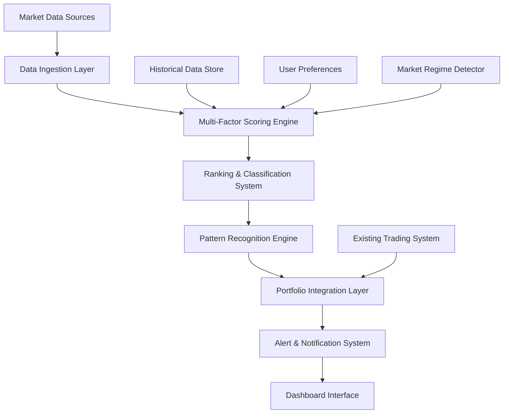

# Smart Stock Scanner Design Document

## Overview

The Smart Stock Scanner is an advanced investment recommendation system that extends the existing institutional trading terminal with automated stock screening, multi-factor scoring, and intelligent ranking capabilities. The system leverages quantitative analysis, pattern recognition, and market regime detection to identify high-probability investment opportunities across hundreds of stocks.

Building upon the proven architecture of the existing trading system, the Smart Stock Scanner introduces a new layer of automation that continuously evaluates market opportunities and presents them in a ranked, actionable format. The system integrates seamlessly with existing position data and provides portfolio-aware recommendations.

## Architecture

### System Architecture Overview

The Smart Stock Scanner follows a modular, event-driven architecture that integrates with the existing Google Sheets-based trading terminal:



### Integration with Existing System

The Smart Stock Scanner extends the current trading terminal architecture by adding new sheets and enhancing existing functionality:

**New Sheets:**
- **SCANNER_CONFIG**: Configuration and screening criteria
- **SCANNER_RESULTS**: Ranked stock results with scores and signals
- **SECTOR_ANALYSIS**: Sector rotation and market regime analysis
- **PERFORMANCE_TRACKING**: Historical performance and backtesting data

**Enhanced Existing Sheets:**
- **INPUT**: Extended with scanner configuration options
- **CALCULATIONS**: Enhanced with multi-factor scoring algorithms
- **DASHBOARD**: Integrated scanner results display

## Components and Interfaces

### 1. Data Ingestion Layer

**Purpose**: Collect and normalize market data from multiple sources for analysis.

**Components:**
- **Market Data Collector**: Extends existing Google Finance integration
- **Fundamental Data Processor**: P/E, EPS, revenue growth, sector classifications
- **Technical Data Calculator**: RSI, MACD, ADX, volume patterns from existing indicators
- **Sector Performance Analyzer**: Relative sector strength calculations

**Interfaces:**
```javascript
interface MarketDataCollector {
  collectStockData(tickers: string[]): Promise<StockData[]>
  updateSectorData(): Promise<SectorData[]>
  getMarketRegime(): MarketRegime
}

interface StockData {
  ticker: string
  price: number
  volume: number
  fundamentals: FundamentalData
  technicals: TechnicalData
  sectorCode: string
}
```

### 2. Multi-Factor Scoring Engine

**Purpose**: Calculate comprehensive investment scores using multiple quantitative factors.

**Scoring Algorithm:**
The Investment_Score (0-100) combines weighted factors based on current market regime:

```
Investment_Score = Σ(Factor_i × Weight_i × Regime_Multiplier_i)
```

**Factor Categories:**
1. **Technical Momentum (25-35% weight)**
   - RSI momentum score
   - MACD histogram strength
   - ADX trend strength
   - Price vs moving averages

2. **Fundamental Value (20-30% weight)**
   - P/E ratio relative to sector
   - EPS growth rate
   - Revenue growth consistency
   - Debt-to-equity ratio

3. **Relative Strength (15-25% weight)**
   - Performance vs S&P 500
   - Performance vs sector
   - 52-week high proximity
   - Volume-weighted relative strength

4. **Volume & Flow (10-20% weight)**
   - Relative volume patterns
   - Institutional flow indicators
   - Volume price trend analysis
   - Accumulation/distribution patterns

**Dynamic Weighting by Market Regime:**
- **Bull Market**: Technical 35%, Fundamental 20%, Relative 25%, Volume 20%
- **Bear Market**: Technical 25%, Fundamental 35%, Relative 15%, Volume 25%
- **Neutral Market**: Technical 30%, Fundamental 25%, Relative 20%, Volume 25%

**Interfaces:**
```javascript
interface ScoringEngine {
  calculateInvestmentScore(stock: StockData, regime: MarketRegime): InvestmentScore
  getFactorBreakdown(ticker: string): FactorBreakdown
  updateWeightings(regime: MarketRegime): void
}

interface InvestmentScore {
  totalScore: number // 0-100
  technicalScore: number
  fundamentalScore: number
  relativeStrengthScore: number
  volumeScore: number
  confidence: number
}
```

### 3. Ranking & Classification System

**Purpose**: Rank stocks by investment attractiveness and classify into actionable tiers.

**Ranking Algorithm:**
1. Sort all stocks by Investment_Score (descending)
2. Apply tiebreaker logic (volume × momentum for equal scores)
3. Assign Opportunity_Rank (1 = best, N = worst)
4. Classify into tiers: TOP_10, TOP_25, TOP_50, WATCHLIST

**Classification Logic:**
```javascript
function classifyOpportunity(rank: number, totalStocks: number): OpportunityTier {
  if (rank <= 10) return OpportunityTier.TOP_10
  if (rank <= 25) return OpportunityTier.TOP_25
  if (rank <= 50) return OpportunityTier.TOP_50
  if (rank <= totalStocks * 0.25) return OpportunityTier.WATCHLIST
  return OpportunityTier.AVOID
}
```

**Interfaces:**
```javascript
interface RankingSystem {
  rankStocks(scores: InvestmentScore[]): RankedStock[]
  detectRankingChanges(current: RankedStock[], previous: RankedStock[]): RankingChange[]
  classifyTiers(rankedStocks: RankedStock[]): TierClassification
}
```

### 4. Pattern Recognition Engine

**Purpose**: Identify advanced technical patterns and institutional setups.

**Pattern Types:**
1. **Breakout Patterns**
   - Volume-confirmed resistance breaks
   - New 52-week high breakouts
   - Consolidation breakouts

2. **Mean Reversion Patterns**
   - Oversold bounces at support
   - Bollinger Band reversals
   - RSI divergence setups

3. **Volatility Patterns**
   - Volatility squeeze detection
   - ATR expansion patterns
   - Volume surge identification

4. **Institutional Patterns**
   - Accumulation/distribution analysis
   - Dark pool flow indicators
   - Smart money positioning

**Pattern Confidence Scoring:**
Each pattern receives a confidence score (0-100) based on:
- Historical success rate of the pattern
- Volume confirmation strength
- Multiple timeframe alignment
- Market regime compatibility

**Interfaces:**
```javascript
interface PatternRecognition {
  detectPatterns(stockData: StockData[]): PatternResult[]
  calculatePatternConfidence(pattern: Pattern, context: MarketContext): number
  getPriceTargets(pattern: Pattern): PriceTarget[]
}

interface Pattern {
  type: PatternType
  confidence: number
  expectedMove: number
  timeframe: string
  description: string
}
```

### 5. Action Signal Generation

**Purpose**: Generate clear buy/sell/hold recommendations based on scores and patterns.

**Signal Generation Logic:**
```javascript
function generateActionSignal(
  score: InvestmentScore, 
  patterns: Pattern[], 
  position: Position | null,
  marketRegime: MarketRegime
): ActionSignal {
  
  // Position-aware logic
  if (position) {
    return generatePositionAwareSignal(score, patterns, position, marketRegime)
  }
  
  // New position logic
  if (score.totalScore >= 80 && hasBullishMomentum(patterns)) {
    return ActionSignal.BUY
  }
  if (score.totalScore >= 70 && isTopTier(score.rank)) {
    return ActionSignal.ACCUMULATE
  }
  if (score.totalScore >= 60 && hasValueRating(score)) {
    return ActionSignal.WATCH
  }
  if (score.totalScore <= 30 || hasBearishBreakdown(patterns)) {
    return ActionSignal.SELL
  }
  
  return ActionSignal.HOLD
}
```

**Signal Types:**
- **BUY**: High conviction entry opportunity
- **ACCUMULATE**: Good entry with gradual building
- **WATCH**: Potential opportunity requiring monitoring
- **HOLD**: Maintain current position
- **TRIM**: Reduce position size
- **SELL**: Exit position or avoid

### 6. Risk Assessment System

**Purpose**: Categorize stocks by risk level and calculate appropriate position sizes.

**Risk Tier Classification:**
```javascript
function calculateRiskTier(stockData: StockData): RiskTier {
  const atrRatio = stockData.technicals.atr / stockData.price
  const beta = stockData.fundamentals.beta
  const fundamentalRisk = assessFundamentalRisk(stockData.fundamentals)
  
  if (atrRatio <= 0.02 && beta <= 1.2 && fundamentalRisk === 'LOW') {
    return RiskTier.LOW
  }
  if (atrRatio <= 0.05 && beta <= 1.5 && fundamentalRisk !== 'HIGH') {
    return RiskTier.MEDIUM
  }
  if (atrRatio <= 0.08 && beta <= 2.0) {
    return RiskTier.HIGH
  }
  
  return RiskTier.EXTREME
}
```

**Position Sizing Algorithm:**
```javascript
function calculatePositionSize(
  score: InvestmentScore,
  riskTier: RiskTier,
  portfolioRisk: number
): PositionSize {
  
  const baseSize = 0.02 // 2% base allocation
  const scoreMultiplier = Math.min(2.0, score.totalScore / 50)
  const riskMultiplier = getRiskMultiplier(riskTier)
  const portfolioMultiplier = Math.max(0.5, 1 - portfolioRisk)
  
  const recommendedSize = baseSize * scoreMultiplier * riskMultiplier * portfolioMultiplier
  
  return {
    percentage: Math.min(0.08, recommendedSize), // Max 8% position
    rationale: generateSizingRationale(score, riskTier, portfolioRisk)
  }
}
```

### 7. Market Regime Detection

**Purpose**: Identify current market conditions to adjust scoring and recommendations.

**Regime Detection Algorithm:**
Uses multiple indicators to classify market regime:

1. **Price-based Indicators**
   - S&P 500 vs 200-day SMA
   - Percentage of stocks above 200-day SMA
   - New highs vs new lows ratio

2. **Volatility Indicators**
   - VIX level and trend
   - Realized volatility vs historical average
   - Cross-asset volatility correlations

3. **Momentum Indicators**
   - Market breadth indicators
   - Sector rotation patterns
   - Risk-on vs risk-off asset performance

**Regime Classifications:**
- **STRONG_BULL**: VIX < 15, >70% stocks above 200-day SMA, strong momentum
- **BULL**: VIX < 20, >60% stocks above 200-day SMA, positive momentum
- **NEUTRAL**: VIX 20-30, mixed signals, choppy action
- **BEAR**: VIX > 30, <40% stocks above 200-day SMA, negative momentum
- **STRONG_BEAR**: VIX > 40, <30% stocks above 200-day SMA, panic conditions

### 8. Sector Rotation Analysis

**Purpose**: Identify sector trends and rotation opportunities.

**Sector Analysis Components:**
1. **Relative Performance Tracking**
   - Sector vs S&P 500 performance (1D, 1W, 1M, 3M)
   - Momentum persistence analysis
   - Volume flow by sector

2. **Rotation Detection**
   - Leadership change identification
   - Defensive vs cyclical rotation
   - Growth vs value style rotation

3. **Sector Scoring**
   - Technical momentum score
   - Fundamental attractiveness
   - Relative valuation metrics
   - Institutional flow indicators

**Interfaces:**
```javascript
interface SectorAnalysis {
  analyzeSectorPerformance(): SectorPerformance[]
  detectRotation(): RotationSignal[]
  scoreSectors(): SectorScore[]
  identifyLeadersLaggards(): SectorRanking
}
```

## Data Models

### Core Data Structures

```javascript
interface StockAnalysis {
  ticker: string
  investmentScore: InvestmentScore
  opportunityRank: number
  tier: OpportunityTier
  actionSignal: ActionSignal
  riskTier: RiskTier
  patterns: Pattern[]
  positionSize: PositionSize
  reasoning: string
  lastUpdated: Date
}

interface SectorData {
  sectorCode: string
  name: string
  performance: {
    oneDay: number
    oneWeek: number
    oneMonth: number
    threeMonth: number
  }
  momentum: number
  relativeStrength: number
  institutionalFlow: number
  ranking: number
}

interface MarketRegime {
  current: RegimeType
  confidence: number
  indicators: {
    vix: number
    breadth: number
    momentum: number
  }
  duration: number // days in current regime
  lastChange: Date
}

interface PortfolioAnalysis {
  totalValue: number
  sectorAllocation: SectorAllocation[]
  riskDistribution: RiskDistribution
  correlationMatrix: number[][]
  recommendedChanges: RebalanceRecommendation[]
}
```

## Correctness Properties

*A property is a characteristic or behavior that should hold true across all valid executions of a system—essentially, a formal statement about what the system should do. Properties serve as the bridge between human-readable specifications and machine-verifiable correctness guarantees.*

### Property 1: Investment Score Bounds
*For any* stock with valid market data, the calculated Investment_Score should always be between 0 and 100 inclusive
**Validates: Requirements 1.4**

### Property 2: Ranking Consistency
*For any* set of stocks with Investment_Scores, stocks should be ranked in descending order by score, with rank 1 being the highest score
**Validates: Requirements 1.5, 3.1**

### Property 3: Factor Normalization
*For any* individual factor used in scoring, the normalized factor value should be between 0 and 100 before weighting is applied
**Validates: Requirements 2.6**

### Property 4: Score Component Influence
*For any* stock, changes in technical momentum indicators (RSI, MACD, ADX, Stochastic) should affect the final Investment_Score
**Validates: Requirements 2.1**

### Property 5: Fundamental Impact
*For any* stock, changes in fundamental valuation metrics (P/E, EPS growth, revenue growth) should affect the final Investment_Score
**Validates: Requirements 2.2**

### Property 6: Regime-Based Weighting
*For any* stock, the same fundamental and technical data should produce different Investment_Scores in different Market_Regime conditions
**Validates: Requirements 2.5, 6.4**

### Property 7: Tier Classification Consistency
*For any* ranked stock list, stocks should be classified into tiers (TOP_10, TOP_25, TOP_50, WATCHLIST) based on their Opportunity_Rank position
**Validates: Requirements 3.3**

### Property 8: Signal Generation Rules
*For any* stock with Investment_Score >= 80 AND positive technical momentum, the system should generate a BUY signal
**Validates: Requirements 4.1**

### Property 9: Risk Tier Classification
*For any* stock with ATR/Price ratio <= 2%, the system should classify it as LOW risk tier
**Validates: Requirements 5.2**

### Property 10: Position Size Bounds
*For any* stock recommendation, the calculated position size should not exceed 8% of total portfolio value
**Validates: Requirements 5.6**

### Property 11: Portfolio Risk Warning
*For any* portfolio where HIGH/EXTREME risk stocks exceed 25% allocation, the system should generate a warning
**Validates: Requirements 5.7**

### Property 12: Pattern Detection Consistency
*For any* stock showing breakout patterns above resistance with volume confirmation, the pattern recognition engine should detect and flag the breakout
**Validates: Requirements 7.1**

### Property 13: Position-Aware Recommendations
*For any* stock, the system should generate different Action_Signal recommendations based on whether the stock is currently owned or not
**Validates: Requirements 4.6, 9.2**

### Property 14: Alert Triggering
*For any* stock entering the TOP_10 ranking for the first time, the system should trigger an alert
**Validates: Requirements 10.1**

### Property 15: Historical Performance Tracking
*For any* BUY recommendation, the system should track price performance over 1, 3, 6, and 12 month periods
**Validates: Requirements 11.1**

### Property 16: Custom Filter Application
*For any* user-defined screening criteria (min/max values for metrics), only stocks meeting those criteria should appear in results
**Validates: Requirements 12.1**

### Property 17: Sector Filter Effectiveness
*For any* sector inclusion/exclusion filter, only stocks from included sectors should appear in screening results
**Validates: Requirements 12.2**

### Property 18: Scoring Weight Customization
*For any* custom weighting of Investment_Score factors, the final scores should reflect the user-specified weightings
**Validates: Requirements 12.3**

### Property 19: Data Import Consistency
*For any* existing position data imported from the trading system, the position status should be correctly reflected in recommendations
**Validates: Requirements 9.1**

### Property 20: Capital Constraint Validation
*For any* set of recommendations where total position sizes exceed available capital, the system should generate an alert
**Validates: Requirements 9.7**

## Error Handling

### Data Quality Management

**Missing Data Handling:**
- Graceful degradation when fundamental data is unavailable
- Default scoring for stocks with incomplete technical indicators
- Clear flagging of stocks with insufficient data quality

**API Failure Recovery:**
- Retry mechanisms for Google Finance API failures
- Cached data fallback for temporary outages
- User notification of data staleness

**Calculation Error Handling:**
- Division by zero protection in ratio calculations
- Outlier detection and handling in scoring algorithms
- Validation of score bounds and ranking consistency

### System Resilience

**Performance Degradation:**
- Timeout handling for large stock universe processing
- Progressive loading for dashboard display
- Background processing for non-critical calculations

**Memory Management:**
- Efficient data structures for large datasets
- Garbage collection optimization
- Memory usage monitoring and alerts

**Concurrent Access:**
- Thread-safe operations for multi-user access
- Data consistency during updates
- Lock-free algorithms where possible

## Testing Strategy

### Unit Testing Approach

**Component Testing:**
- Individual scoring factor calculations
- Pattern recognition algorithms
- Risk classification logic
- Signal generation rules

**Edge Case Testing:**
- Extreme market conditions (crashes, bubbles)
- Data quality issues (missing, corrupted data)
- Boundary conditions (score limits, position sizes)
- Tiebreaker scenarios in ranking

### Property-Based Testing Implementation

**Test Framework:** Google Apps Script with custom property testing utilities

**Property Test Configuration:**
- Minimum 100 iterations per property test
- Randomized input generation for comprehensive coverage
- Regression testing against historical data

**Example Property Test:**
```javascript
function testInvestmentScoreBounds() {
  // Property 1: Investment Score Bounds
  for (let i = 0; i < 100; i++) {
    const randomStock = generateRandomStockData()
    const score = calculateInvestmentScore(randomStock)
    
    // Property assertion
    if (score < 0 || score > 100) {
      throw new Error(`Investment score ${score} outside bounds [0,100] for ${randomStock.ticker}`)
    }
  }
}
```

**Property Test Tags:**
Each property test includes a comment tag referencing the design property:
```javascript
// Feature: smart-stock-scanner, Property 1: Investment Score Bounds
```

### Integration Testing

**System Integration:**
- End-to-end screening workflow testing
- Dashboard display and interaction testing
- Alert system integration testing
- Performance tracking accuracy testing

**Data Integration:**
- Google Finance API integration testing
- Existing trading system data import testing
- Historical data consistency validation

### Performance Testing

**Scalability Testing:**
- 200+ stock processing within 5-minute limit
- Dashboard responsiveness with large datasets
- Memory usage under maximum load

**Stress Testing:**
- High-frequency update scenarios
- Concurrent user access patterns
- System behavior during market volatility

### User Acceptance Testing

**Workflow Testing:**
- Complete investment decision workflow
- Portfolio management integration
- Alert and notification effectiveness

**Usability Testing:**
- Dashboard navigation and filtering
- Mobile responsiveness validation
- User customization functionality