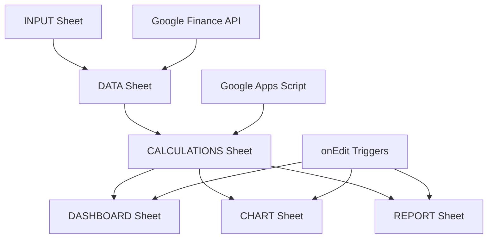

# Trading System Design Document

## Overview

This document outlines the design for a comprehensive Google Sheets-based institutional trading terminal that provides advanced technical analysis, risk management, and decision-making capabilities for equity trading. The system integrates multiple sheets with sophisticated formulas, custom JavaScript functions, and automated monitoring to deliver professional-grade trading intelligence.

## Architecture

### System Architecture

The trading system follows a multi-sheet architecture with real-time data synchronization:



### Data Flow Architecture

```
INPUT (Tickers) → DATA (Market Data + Regime) → CALCULATIONS (34 Indicators) → 
DASHBOARD/CHART/REPORT (Real-time Updates via onEdit triggers)
```

### Technology Stack

- **Platform**: Google Sheets with Google Apps Script
- **Data Sources**: Google Finance API for real-time market data
- **Programming Languages**: JavaScript (Google Apps Script)
- **UI Framework**: Custom HTML/CSS for popups and reports
- **Automation**: Time-based triggers for monitoring and alerts

## Components and Interfaces

### Core Sheets

#### 1. INPUT Sheet
**Purpose**: Configuration and ticker management
- **Interface**: Simple ticker list with configuration flags
- **Key Columns**: 
  - A: Ticker symbols
  - C: Position status ("PURCHASED" tag)
  - E2: Mode toggle (TRUE = INVEST, FALSE = TRADE)

#### 2. DATA Sheet
**Purpose**: Market data aggregation and storage
- **Interface**: GOOGLEFINANCE formulas with error handling
- **Data Sources**: Real-time price, volume, fundamental data
- **Market Regime**: USA (SPY) and India (NIFTY_50) analysis
- **Error Handling**: Graceful fallback mechanisms

#### 3. CALCULATIONS Sheet
**Purpose**: 34-column technical analysis engine
- **Interface**: Complex formula-based calculations
- **Structure**: 
  - Identity & Signaling (A-D)
  - Price & Volume (E-G)
  - Performance Metrics (H-J)
  - Trend Analysis (K-O)
  - Momentum Indicators (P-T)
  - Levels & Risk Management (U-Y)
  - Institutional Features (Z-AH)

#### 4. DASHBOARD Sheet
**Purpose**: Bloomberg-style multi-ticker overview
- **Interface**: Professional dark theme with conditional formatting
- **Features**: 50+ ticker overview, sortable columns, color-coded signals
- **Performance**: <5 second load time for 50 tickers

#### 5. CHART Sheet
**Purpose**: Interactive charting with technical overlays
- **Interface**: Dynamic controls with checkbox toggles
- **Features**: OHLC data, moving averages, volume bars, support/resistance
- **Controls**: Ticker selection, time periods, indicator toggles

#### 6. REPORT Sheet
**Purpose**: Mobile-optimized single-ticker analysis
- **Interface**: Formula-based implementation with floating charts
- **Layout**: 
  - Row 1: Ticker dropdown (A1:C1 merged) + Date display (D1)
  - Row 2: Date selection dropdowns (A2:C2) + Interval (D2)
  - Row 3: Calculated date display (A3:B3) + Weekly/Daily (C3)
  - Rows 4-6: Decision matrix (SIGNAL, FUNDAMENTAL, DECISION)
  - Row 7: Market regime status
  - Rows 8+: Sectioned data with narratives

### JavaScript Components

#### Core Files
- **Code.js** (2,299 lines): Main system logic, onEdit triggers, sheet generation
- **mobilereport-formulas.js** (915 lines): Complete REPORT sheet implementation
- **IndicatorFuncs.js**: Technical indicator implementations
- **Helper.js**: Utility functions and data processing
- **Monitor.js**: Market monitoring and alert system

#### Custom Functions
- **LIVERSI**: Wilder's smoothed RSI calculation
- **LIVEMACD**: 12/26/9 EMA MACD with histogram
- **LIVEADX**: Directional movement analysis
- **LIVEATR**: True Range with Wilder smoothing
- **LIVESTOCHK**: 14-period Stochastic %K

## Data Models

### Market Data Model
```javascript
{
  ticker: string,
  price: number,
  change: number,
  volume: number,
  pe_ratio: number,
  eps: number,
  ath: number,
  regime: "BULL" | "BEAR" | "NEUTRAL"
}
```

### Technical Indicator Model
```javascript
{
  ticker: string,
  sma20: number,
  sma50: number,
  sma200: number,
  rsi: number,
  macd_histogram: number,
  adx: number,
  atr: number,
  stochastic_k: number,
  bollinger_b: number
}
```

### Signal Model
```javascript
{
  ticker: string,
  signal: "STRONG BUY" | "BUY" | "ACCUMULATE" | "HOLD" | "AVOID" | "STOP OUT",
  decision: "STRONG BUY" | "BUY" | "ACCUMULATE" | "HOLD" | "TRIM" | "STOP OUT",
  fundamental: "VALUE" | "FAIR" | "EXPENSIVE",
  pattern: string,
  position_size: number,
  stop_loss: number,
  target: number
}
```

### Chart Data Model
```javascript
{
  ticker: string,
  dates: Date[],
  prices: number[],
  volumes: number[],
  indicators: {
    sma20: number[],
    sma50: number[],
    sma200: number[],
    support: number,
    resistance: number,
    atr_stop: number,
    atr_target: number
  }
}
```

## Correctness Properties

*A property is a characteristic or behavior that should hold true across all valid executions of a system—essentially, a formal statement about what the system should do. Properties serve as the bridge between human-readable specifications and machine-verifiable correctness guarantees.*

### Property 1: Real-time Data Consistency
*For any* ticker in the INPUT sheet, all dependent calculations in CALCULATIONS, DASHBOARD, CHART, and REPORT sheets should update within 5 seconds of a price change.
**Validates: Requirements TBD**

### Property 2: Signal Generation Accuracy
*For any* valid market data input, the signal generation engine should produce consistent results based on the selected mode (INVEST/TRADE) and position status.
**Validates: Requirements TBD**

### Property 3: Technical Indicator Calculations
*For any* historical price data with sufficient length (>14 periods), custom JavaScript functions (LIVERSI, LIVEMACD, LIVEATR, LIVESTOCHK) should return mathematically correct values according to industry standards.
**Validates: Requirements TBD**

### Property 4: Position Size Calculation
*For any* ticker with valid ATR and price data, the position sizing algorithm should return a value between 0.5% and 8% of portfolio allocation based on volatility and risk parameters.
**Validates: Requirements TBD**

### Property 5: Chart Data Synchronization
*For any* ticker selection in the CHART or REPORT sheets, the displayed data should exactly match the corresponding data in the CALCULATIONS sheet.
**Validates: Requirements TBD**

### Property 6: Mobile Report Generation
*For any* ticker with complete data, the REPORT sheet should generate a comprehensive analysis in under 3 seconds with all sections populated.
**Validates: Requirements TBD**

### Property 7: Alert System Reliability
*For any* decision change in the CALCULATIONS sheet, the monitoring system should detect and process the change within 30 minutes during market hours.
**Validates: Requirements TBD**

### Property 8: Error Handling Robustness
*For any* Google Finance API failure or data unavailability, the system should continue operating with cached data and display appropriate error indicators without crashing.
**Validates: Requirements TBD**

### Property 9: Performance Scalability
*For any* number of tickers up to 100, the system should maintain response times under the specified thresholds (5s dashboard, 3s charts, 1s calculations).
**Validates: Requirements TBD**

### Property 10: Data Validation Integrity
*For any* user input or external data source, the system should validate data types, ranges, and formats before processing to prevent calculation errors.
**Validates: Requirements TBD**

## Error Handling

### Data Source Errors
- **Google Finance API Failures**: Implement retry logic with exponential backoff
- **Network Connectivity Issues**: Cache last known values and display staleness indicators
- **Invalid Ticker Symbols**: Show clear error messages and prevent calculation propagation

### Calculation Errors
- **Insufficient Data**: Return default values (RSI=50, others=0) with clear indicators
- **Division by Zero**: Implement defensive checks in all mathematical operations
- **Array Index Errors**: Validate array lengths before processing

### User Input Errors
- **Invalid Ticker Entry**: Real-time validation with suggestion system
- **Configuration Errors**: Prevent invalid mode combinations and provide guidance
- **Date Range Issues**: Automatic correction with user notification

### System Performance Errors
- **Script Timeout**: Break large operations into smaller chunks with progress tracking
- **Memory Limits**: Implement data pagination and cleanup routines
- **Concurrent Access**: Handle multiple user edits with conflict resolution

## Testing Strategy

### Dual Testing Approach

The system requires both unit testing and property-based testing for comprehensive coverage:

**Unit Tests**: Verify specific examples, edge cases, and error conditions
- Individual indicator calculations with known inputs/outputs
- Specific signal generation scenarios
- Error handling with invalid inputs
- Integration points between sheets

**Property Tests**: Verify universal properties across all inputs
- Technical indicator mathematical correctness across random price data
- Signal consistency across different market conditions
- Performance characteristics under varying loads
- Data synchronization across all sheets

### Property-Based Testing Configuration

- **Testing Library**: Google Apps Script testing framework with custom property generators
- **Minimum Iterations**: 100 iterations per property test
- **Test Tagging**: Each property test references its design document property
- **Tag Format**: **Feature: trading-system, Property {number}: {property_text}**

### Testing Implementation

**Technical Indicator Testing**:
- Generate random OHLC price series
- Verify RSI stays within 0-100 range
- Confirm MACD histogram calculation accuracy
- Test ATR non-negative values

**Signal Generation Testing**:
- Test all signal combinations across market regimes
- Verify position-aware logic correctness
- Confirm mode switching behavior

**Performance Testing**:
- Load testing with maximum ticker counts
- Response time validation under various conditions
- Memory usage monitoring during extended operations

**Integration Testing**:
- Cross-sheet data consistency validation
- Real-time update propagation testing
- Chart synchronization verification

### Validation Criteria

- Signal accuracy measured against historical performance
- Risk management effectiveness in drawdown scenarios
- System reliability during high-volatility periods
- Performance benchmarks met consistently